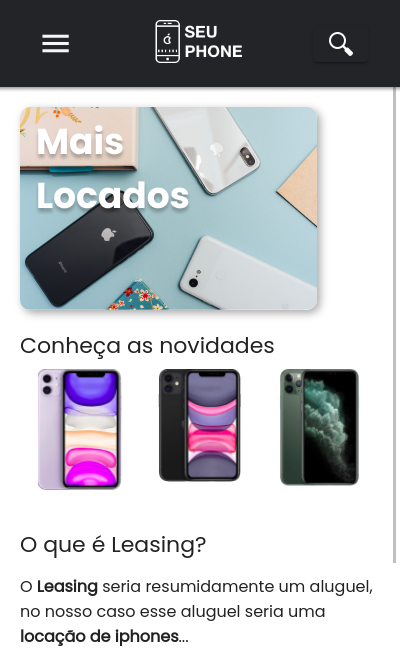
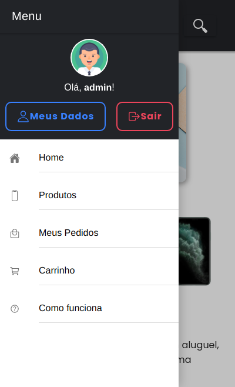
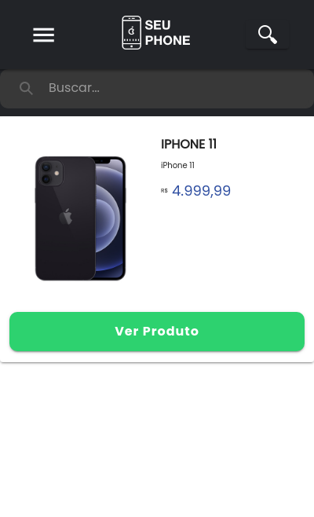
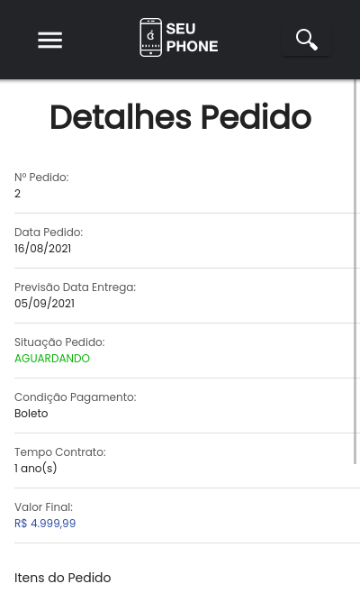

# Seuphone App

Seuphone App é uma aplicação mobile feita em Ionic disponível para Android e iOS.

- ⚠️ Atenção
- Essa aplicação trata-se de um projeto do 3 Semestre do curso de Análise e Desenvolvimento de Sistemas da faculdade FAPEN.
- Esse aplicativo utiliza um sistema desenvolvido anteriormente, você pode consulta-lo [clicando aqui](https://github.com/emersonmelomartins/fapen-seuphone).

##  Preview
<p align="left">
  
  
</p>
<p align="left">
  
  
</p>

## Features

- Criação/Atualização de usuários;
- Upload de avatar;
- Recuperação de senha;
- Listagem de produtos;
- Criação/listagem de pedidos de compra;

## Tecnologias

Esse projeto utiliza:

- [AngularJS] - Facilitador na criação de páginas;
- [Ionic] - Framework para criação de app mobile.
- [Typescript] - Potencializador para tipar o javascript.

## Instalação

Essa aplicação necessita de [Node.js](https://nodejs.org/) instalado para rodar.

Após clonar o repositório, instalar as dependencias.
```sh
npm install
```

Iniciar o projeto.
```sh
npm run start
```

O projeto estará disponível na url:
```sh
http://localhost:4200
```

OBS: Para melhor visualização, coloque seu navegador em modo mobile, você pode seguir um guia [como este aqui.](https://www.techtudo.com.br/dicas-e-tutoriais/noticia/2015/03/como-acessar-versao-para-celular-de-um-site-usando-o-chrome-no-pc.html)